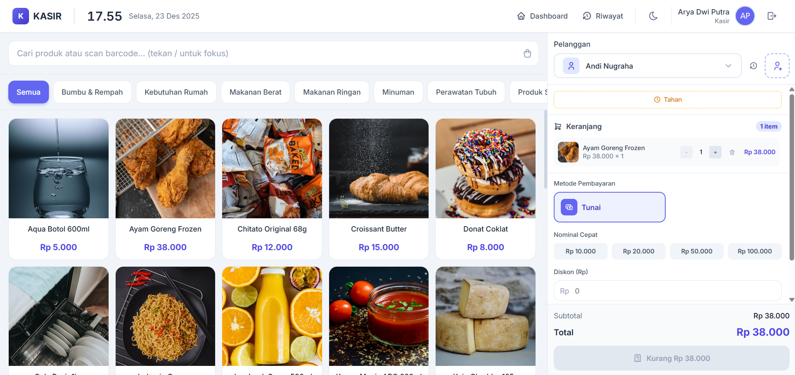

# Point of Sales & ERP System 🚀



## 📖 Tentang Sistem Ini

Sistem Point of Sales (POS) dan ERP (Enterprise Resource Planning) modern yang dirancang untuk mendukung operasional bisnis retail dengan fitur-fitur lengkap:

- **Point of Sales (Kasir)**: Checkout cepat dengan barcode scanner, hold transaction, shortcut keyboard, dan integrasi CRM pelanggan.
- **Manajemen Stok & Multi-Gudang**: Tracking inventori real-time, mutasi stok antar gudang, dan pencatatan barang rusak/expired.
- **Sistem Pre-Order**: Dukungan Down Payment, booking stok otomatis, dan auto-fulfillment saat barang datang.
- **Workflow Persetujuan**: Verifikasi pembayaran oleh finance dan fulfillment oleh warehouse.
- **Akuntansi Otomatis**: Pencatatan jurnal Debit/Kredit otomatis, manajemen piutang, dan laporan keuangan.
- **Pencetakan Dokumen**: Cetak struk thermal (58mm/80mm) dan invoice A4.

---

## 🛠️ Teknologi yang Digunakan

| Kategori | Teknologi |
|----------|-----------|
| **Backend** | Laravel 12, PHP 8.2+ |
| **Frontend** | Vue.js 3 (Composition API), Inertia.js |
| **Styling** | Tailwind CSS |
| **Icons** | Tabler Icons |
| **Charts** | Chart.js |
| **UI Components** | HeadlessUI, SweetAlert2, Vue Toastification |
| **Build Tool** | Vite |
| **Database** | MySQL / SQLite |
| **Authentication** | Laravel Sanctum, Laravel Breeze |
| **Authorization** | Spatie Laravel Permission |

---

## 🚀 Cara Menjalankan

### Prasyarat
- PHP 8.2+
- Composer
- Node.js & NPM
- MySQL atau SQLite

### Langkah-langkah

1. **Clone Repository**
   ```bash
   git clone https://github.com/yudapw37/sistem-medium-erp.git
   cd sistem-medium-erp
   ```

2. **Install Dependensi**
   ```bash
   composer install
   npm install
   ```

3. **Konfigurasi Environment**
   ```bash
   cp .env.example .env
   ```
   Edit file `.env` dan sesuaikan konfigurasi database:
   ```env
   DB_CONNECTION=mysql
   DB_HOST=127.0.0.1
   DB_PORT=3306
   DB_DATABASE=nama_database
   DB_USERNAME=username
   DB_PASSWORD=password
   ```

4. **Setup Database**
   ```bash
   php artisan key:generate
   php artisan migrate --seed
   php artisan storage:link
   ```

5. **Jalankan Aplikasi**
   
   Buka 2 terminal terpisah:
   
   **Terminal 1** - Build assets:
   ```bash
   npm run dev
   ```
   
   **Terminal 2** - Web server:
   ```bash
   php artisan serve
   ```

6. **Akses Aplikasi**
   
   Buka browser dan kunjungi: `http://localhost:8000`

### 👤 Akun Demo

| Role | Email | Password |
|------|-------|----------|
| Admin | arya@gmail.com | password |
| Kasir | cashier@gmail.com | password |

---

Made with ❤️ by Point of Sales Community.