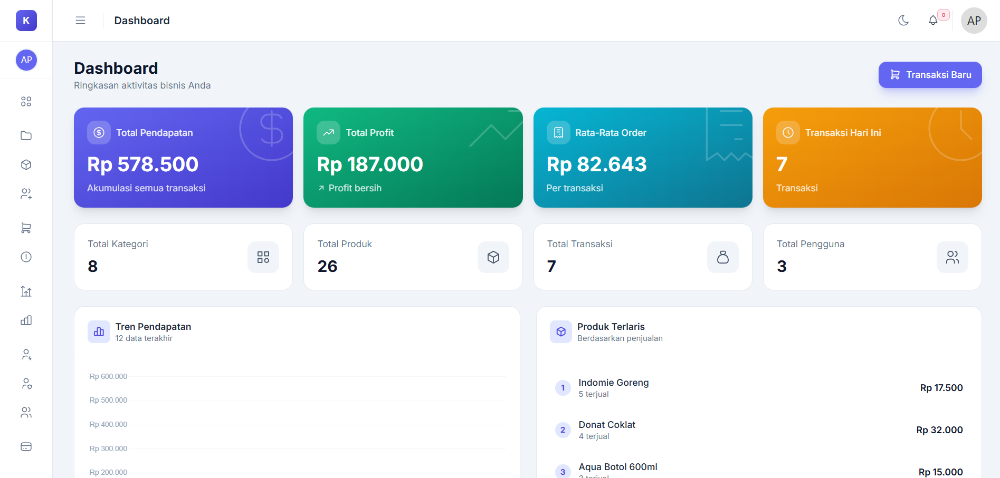

# Point of Sales – Laravel & Inertia

> Sistem kasir modern dengan alur transaksi cepat, dukungan laporan, dan mode cetak invoice yang rapi. Kalau kamu suka proyek ini, bantu dengan menekan ⭐ di atas – itu sangat membantu visibilitas repositori ini.


<sub>_Cuplikan antarmuka kasir revamp. Screenshot tambahan ada di bagian di bawah._</sub>

## 🆕 What's New (Revamp 2.0)

-   **UI/UX Redesign** – Tampilan modern dengan tema slate/primary, gradient accents, dan dark mode ready
-   **Landing Page Baru** – Halaman depan profesional dengan preview & perbandingan V1 vs Revamp
-   **Hold Transaction** – Simpan keranjang sementara, lanjutkan nanti
-   **Customer History** – Lihat riwayat transaksi pelanggan langsung dari halaman kasir
-   **Add Customer Modal** – Tambah pelanggan baru tanpa meninggalkan halaman transaksi
-   **Keyboard Shortcuts** – `/` atau `F5` untuk search, `Esc` untuk clear, dan lainnya
-   **Thermal Receipt** – Dukungan print struk 58mm dan 80mm
-   **Sample Data Seeder** – Data contoh lengkap dengan gambar produk

## ✨ Kenapa Menarik?

-   **Kasir cepat & intuitif** – pencarian barcode, keranjang, ringkasan pembayaran, dan kalkulasi diskon otomatis.
-   **Invoice siap cetak & payment link** – setelah transaksi, kasir bisa melihat preview invoice elegan, membagikan link pembayaran Midtrans/Xendit, dan memilih kapan mau mencetaknya.
-   **Laporan lengkap** – dari penjualan, profit, sampai riwayat transaksi dengan filter multi parameter.
-   **Akses berbasis role** – integrasi Spatie Permissions bawaan untuk role, user, dan hak akses yang granular.
-   **Dark mode ready** – UI sudah disiapkan untuk mode gelap/terang tanpa konfigurasi tambahan.

## 🔧 Teknologi Inti

-   [Laravel 12](https://laravel.com) + [Inertia.js](https://inertiajs.com)
-   [React](https://react.dev) + [Tailwind CSS](https://tailwindcss.com)
-   [Spatie Laravel Permission](https://spatie.be/docs/laravel-permission)
-   [Tabler Icons](https://tabler-icons.io) untuk ikon kasir modern
-   Integrasi payment gateway Midtrans Snap & Xendit Invoice (opsional)

## 🚀 Cara Menjalankan

```bash
git clone https://github.com/aryadwiputra/point-of-sales.git
cd point-of-sales
cp .env.example .env
composer install && npm install
php artisan key:generate
php artisan migrate --seed
php artisan storage:link
npm run dev
php artisan serve
```

### Default Login

-   **Admin**: `arya@gmail.com` / `password`
-   **Kasir**: `cashier@gmail.com` / `password`

> **Tip:** Jalankan `php artisan db:seed --class=SampleDataSeeder` untuk data contoh lengkap dengan gambar.

## 📊 Fitur Utama

-   **Dashboard**: ringkasan kategori, produk, transaksi, pendapatan, dan trend chart.
-   **Kelola Produk & Stok**: CRUD lengkap dengan kategori dan barcode unik.
-   **Modul Kasir**: pencarian barcode, keranjang multi item, diskon, hitung kembalian otomatis, dan pilihan gateway (tunai, Midtrans, Xendit).
-   **Hold Transaction**: Simpan keranjang sementara dan lanjutkan nanti.
-   **Customer History**: Lihat statistik dan riwayat transaksi pelanggan.
-   **Invoice / Payment Link**: tampilan siap cetak + tombol manual print dan tautan pembayaran yang bisa dibagikan ke pelanggan.
-   **Thermal Receipt**: Dukungan cetak struk thermal 58mm dan 80mm.
-   **Riwayat Transaksi**: filter per tanggal/invoice/kasir + export laporan.
-   **Laporan Profit & Penjualan**: pantau performa bisnis dalam sekali klik.

## ⌨️ Keyboard Shortcuts

| Shortcut      | Aksi                        |
| ------------- | --------------------------- |
| `/` atau `F5` | Fokus pencarian produk      |
| `Escape`      | Clear search & tutup modal  |
| `F1`          | Buka numpad                 |
| `F2`          | Submit transaksi            |
| `F4`          | Tampilkan bantuan shortcuts |

## 📷 Cuplikan Layar

### Versi Revamp 2.0

| Modul     | Preview                                                |
| --------- | ------------------------------------------------------ |
| Dashboard |  |
| Kasir/POS |              |

<sub>_Tidak ada file? Silakan ganti dengan screenshot kamu sendiri di `public/media`._</sub